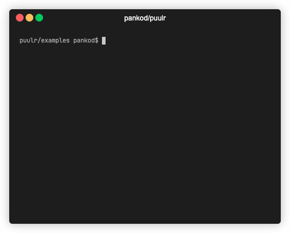

<div align="center">
 
  &nbsp;&nbsp;&nbsp;&nbsp;&nbsp;&nbsp;&nbsp;&nbsp;&nbsp;&nbsp;&nbsp;&nbsp;
</div>

<br/>
<div align="center"> <h3><b>@pankod/canvas2video</b></h3><h3><b>Canvas to Video</b><h3> </div>

<div align="center"> Simplifies the way to create a video from canvas content </div>
<br/>
<div align="center">

[](https://codeclimate.com/github/pankod/canvas2video/maintainability)
[](https://codeclimate.com/github/pankod/canvas2video/test_coverage)
[](https://www.npmjs.com/package/@pankod/canvas2video)

[](https://david-dm.org/pankod/canvas2video)
[](https://david-dm.org/pankod/canvas2video?type=dev)

</div>
<div align="center">
  <sub>Created by <a href="https://www.pankod.com">Pankod</a></sub>
</div>
<br/>
<br/>

## About

@pankod/canvas2video helps you to create videos with ease by using [gsap](https://github.com/greensock/GSAP) and [fabric](https://github.com/fabricjs/fabric.js) libraries.

## Getting started

To install the module, run the following in the command line:

```bash
npm install @pankod/canvas2video --save
```

or

```bash
yarn add @pankod/canvas2video
```

## Usage

Library exports two different functions `renderer` and `encoder`.

Define canvas properties and create stream with makeScene function by using fabric and gsap animation library methods. You get a stream as a return which then you'll use in the `encoder` function which convert canvas to video output.

You can also define a background video in `encoder` function which will be applied to your canvas with a beautiful filter.

```js
import { renderer, encoder } from "@pankod/canvas2video";

const helloWorld = async () => {
    const stream = await renderer({
        silent: false,
        width: 1920,
        height: 1080,
        fps: 30,
        makeScene: (fabric, canvas, anim, compose) => {
            var text = new fabric.Text("Hello world", {
                left: 400,
                top: 400,
                fontSize: 100,
                fill: "#f99339",
                angle: 0,
            });
            canvas.add(text);
            anim.to(text, {
                duration: 1,
                angle: 360,
                ease: Power3.easeOut,
            });
            compose();
        },
    });

    const output = await encoder({
        silent: false,
        frameStream: stream,
        output: "output/hello-world.mp4",
        fps: {
            input: 30,
            output: 30,
        },
    });
    console.log("process done,", output.path);
};
```

For more detailed usage, checkout our examples.

## Examples

<div align="center">
 
</div>

<br/>

We've provided two examples to demonstrate how canvas2video works and what can be done. See [examples](./examples)

#### **Installation**

```bash
git clone https://github.com/pankod/canvas2video.git
cd examples
npm i
```

#### **Hello World**

```bash
npm run start:hello-world
```

#### **Weather**

```bash
npm run start:weather
```

<br/>

## Options

### **Renderer**

| Properties                      | Type       | Description                          |
| ------------------------------- | ---------- | ------------------------------------ |
| **width** <br> \*_required_     | `number`   | Width of your canvas                 |
| **height** <br> \*_required_    | `number`   | Height of your canvas                |
| **fps** <br> \*_required_       | `number`   | Frames per second of your animations |
| **makeScene** <br> \*_required_ | `function` | [See below](#makeScene)              |

<br/>

#### **_makeScene_**

You can create contents by using fabric, gsap library methods which comes default with makeScene function.

This function takes 4 arguments(fabric, canvas, anim and compose) which is passed by the `renderer` function.

```js
renderer({
    /* .. */
    makeScene: (fabric, canvas, anim, compose) => {
        /**
         * your code to create and manipulate your canvas
         */
    },
});
```

| _Parameter_ | _Type_              |                                               |
| ----------- | ------------------- | --------------------------------------------- |
| **fabric**  | fabric.js instance  | [Repo](https://github.com/fabricjs/fabric.js) |
| **canvas**  | fabric.StaticCanvas | [Repo](https://github.com/fabricjs/fabric.js) |
| **anim**    | gsap.TimelineMax    | [Repo](https://github.com/greensock/GSAP)     |
| **compose** | () => void          |

<br/>

### **Encoder**

| Properties                        | Type       | Description                         |
| --------------------------------- | ---------- | ----------------------------------- |
| **frameStream** <br> \*_required_ | `Readable` | Output of your `renderer` call      |
| **output** <br> \*_required_      | `string`   | Your output file path               |
| **fps\*** <br> \*_required_       | `Object`   | `{ input: number, output: number }` |
| **backgroundVideo**               | `Object`   | [See below](#backgroundVideo)       |

<br/>

#### **_backgroundVideo_**

```ts
backgroundVideo: {
  videoPath: string, // your background video path
  inSeconds: number, // video start time in seconds
  outSeconds: number, // video end time in seconds
}
```

<br/>

## License

[License](./LICENSE)
